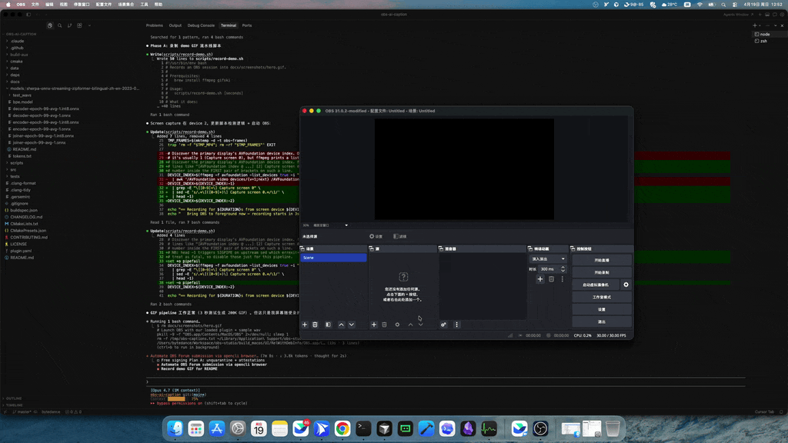

# 🎙️ CaptionFlow

> **Independent third-party plugin for OBS Studio that turns local audio into live captions on your machine.**
>
> CaptionFlow is not developed by, endorsed by, or affiliated with the OBS Project.

<p align="center">
  <a href="https://github.com/XWHQSJ/captionflow/actions/workflows/push.yaml"></a>
  <a href="https://github.com/XWHQSJ/captionflow/releases/latest"></a>
  <a href="LICENSE"></a>
  <a href="#-platforms"></a>
</p>

<p align="center">
  <b>Streaming ASR &middot; Bilingual (EN + 中文) &middot; Sensitive-word beep &middot; GPU acceleration &middot; GPL-2.0-or-later</b>
</p>

<p align="center">
  
</p>

---

## ✨ Why this plugin?

CaptionFlow keeps speech recognition local during use: your microphone or desktop audio is decoded by sherpa-onnx on your machine, and captions are written to a text file that OBS Studio can read. The first model download contacts the upstream model host; after that, captioning works offline with the cached model.

The initial release focuses on three practical jobs: low-latency English captions, a bilingual Chinese/English preset, and an optional delay-line mute filter for sensitive words.

---

## 🖼️ Features at a glance

<table>
<tr>
<td width="50%">

### 🎯 Real-time captions

- Low-latency partial results while speech is still in progress
- Final segmentation via rule-based endpointer
- Writes atomically to a `.txt` file you feed into any OBS Text source

</td>
<td width="50%">

### 📥 One-click model download

- Pick English / bilingual / tiny preset inside the filter panel
- Progress bar + SHA verification
- Cached under `~/…/obs-studio/plugin_config/captionflow/`

</td>
</tr>
<tr>
<td width="50%">

### 🤫 Sensitive-word mute

- Load a hotwords file (`word :boost`)
- Plugin **delays output audio** so it can retroactively beep out matches
- Beep frequency/volume adapts to the live speaker's **F0 + RMS**

</td>
<td width="50%">

### ⚡ Hardware acceleration

- **CPU** (default, universal)
- **CUDA** (Windows + NVIDIA GPU)
- **DirectML** (Windows + any GPU)
- CoreML backend on macOS (coming v0.2)

</td>
</tr>
</table>

---

## 🚀 Install

Requires OBS Studio 31.0+.

### GitHub Releases

1. Head to the [latest release](https://github.com/XWHQSJ/captionflow/releases/latest) and grab:
   - Windows: `captionflow-<version>-windows-x64.zip`
   - macOS: `captionflow-<version>-macos-universal.pkg`
2. **Windows** — extract the zip, merge `obs-plugins\` and `data\obs-plugins\`
   into `%ProgramFiles%\obs-studio\`.
3. **macOS** — double-click the `.pkg`; it installs into
   `~/Library/Application Support/obs-studio/plugins/`.
4. Restart OBS.

> ### 🛡️ About the unsigned release
>
> The current packages are unsigned. Before installing, download them only from
> the GitHub release page and verify the Sigstore build provenance attestation:
>
> ```bash
> gh attestation verify captionflow-0.1.0-macos-universal.pkg \
>   --repo XWHQSJ/captionflow
> ```
>
> We are working toward Windows Authenticode and Apple Developer ID signing.


## 🎬 First use (60 seconds)

```
  ┌───────────────┐   ┌─────────────────┐   ┌────────────────┐
  │  Audio Source │   │  CaptionFlow    │   │ Text (GDI+)    │
  │  (mic / desk) │──▶│   Filter        │──▶│ Read from file │
  └───────────────┘   │   + Downloader  │   └────────────────┘
                      └─────────────────┘
```

1. Right-click an audio source → **Filters → + → CaptionFlow**
2. Click **Download Model…** and pick a preset
3. Set **Caption Output File** to `/tmp/captions.txt` (or anywhere)
4. Add a `Text (GDI+)` / `Text (FreeType 2)` source → enable
   **Read from file** → point it at the same path
5. Speak. Watch captions.

---

## 🧠 Model presets

| Preset | Languages | Size | Best for |
| --- | --- | --- | --- |
| **English (20M, fast)** | en | ~70 MB | default streamers |
| **Chinese + English** | zh, en | ~300 MB | bilingual content |
| **English (tiny)** | en | ~40 MB | low-end CPUs |

Models come from the official
[sherpa-onnx model zoo](https://github.com/k2-fsa/sherpa-onnx/releases/tag/asr-models).
Download is one-shot and cached; re-installing the plugin does not re-download.

---

## 🛠️ Build from source

Dependencies (obs-studio, Qt6, sherpa-onnx) are fetched automatically by
`buildspec.json`. You only need CMake 3.28+ and a platform toolchain.

```bash
# macOS
cmake --preset macos -S . -B build_macos \
  -DCMAKE_OSX_DEPLOYMENT_TARGET=11.0
cmake --build build_macos --config RelWithDebInfo -j

# Windows (PowerShell)
cmake --preset windows-x64 -S . -B build_x64
cmake --build build_x64 --config RelWithDebInfo -j

# Offline unit tests — no OBS, no sherpa-onnx, no internet
cmake -S tests -B build-tests
cmake --build build-tests -j
ctest --test-dir build-tests --output-on-failure
# -> 45 passed, 0 failed
```

---

## 🏗️ Architecture

```
 ┌─────────────── caption-filter.cpp ────────────────┐
 │  OBS audio cb ─┐                ┌── caption file  │
 │                ▼                │                 │
 │     ┌────────────────┐   ┌──────┴──────┐          │
 │     │ AudioAnalyzer  │   │ Subtitle    │          │
 │     │ (RMS + F0)     │   │ Manager     │          │
 │     └──────┬─────────┘   └─────────────┘          │
 │            │                                       │
 │     ┌──────▼─────────┐   ┌─────────────┐          │
 │     │ AudioDelayBuf  │   │ AsrEngine   │◀─ model  │
 │     │ (+ BeepGen)    │   │ (decode thd)│   dir    │
 │     └──────┬─────────┘   └─────┬───────┘          │
 │            │                   │                  │
 │         audio out          partials/              │
 │                            finals                 │
 └───────────────────────────────────────────────────┘
                            │
                            ▼
                     MuteWordList
              ascii/utf-8 hotword matcher
```

- **SPSC lock-free ring buffer** (`AudioRingBuffer`) between OBS audio thread and ASR decode thread
- **Autocorrelation pitch detector** adapts the beep frequency to the speaker
- **Word-boundary-aware hotword matcher** handles ASCII and mixed CJK
- **Atomic caption file writes** so downstream readers never see a half-written line

---

## 🧪 Quality


- 45 unit tests across ring buffer, analyzer, delay line, mute matcher, subtitle manager, model finder
- Tests run under `-Werror` + AddressSanitizer + UndefinedBehaviorSanitizer in CI
- Regression tests for every fixed bug (SPSC lost-wakeup, boundary underflow, …)

---

## 🗺️ Roadmap

- [x] macOS universal + Windows x64 CI builds
- [x] On-demand model download UI
- [ ] Code signing (Apple Developer ID + Windows Authenticode)
- [ ] CoreML provider on macOS (faster on Apple Silicon)
- [ ] More languages (ja, ko, es)
- [ ] Whisper-based fallback for broadcast-grade accuracy

---

## 🤝 Contributing

PRs welcome! See [CONTRIBUTING.md](CONTRIBUTING.md) for how to build, run
tests, and open a pull request. Bug reports and feature requests go in
[issues](https://github.com/XWHQSJ/captionflow/issues).

---

## 📜 License & credits

Licensed under **GPL-2.0-or-later** for OBS Studio plugin compatibility — see [LICENSE](LICENSE).

Built on the work of:

- [OBS Studio](https://github.com/obsproject/obs-studio) — plugin host and SDK
- [obs-plugintemplate](https://github.com/obsproject/obs-plugintemplate) — build-system scaffolding
- [sherpa-onnx](https://github.com/k2-fsa/sherpa-onnx) — streaming ASR runtime

Development note: LLM tools helped draft and revise parts of the code and documentation. The maintainer reviewed, edited, built, and tested the release before publication.

---

<p align="center">
  <sub>Built with ❤️ for streamers who care about privacy.</sub>
</p>
